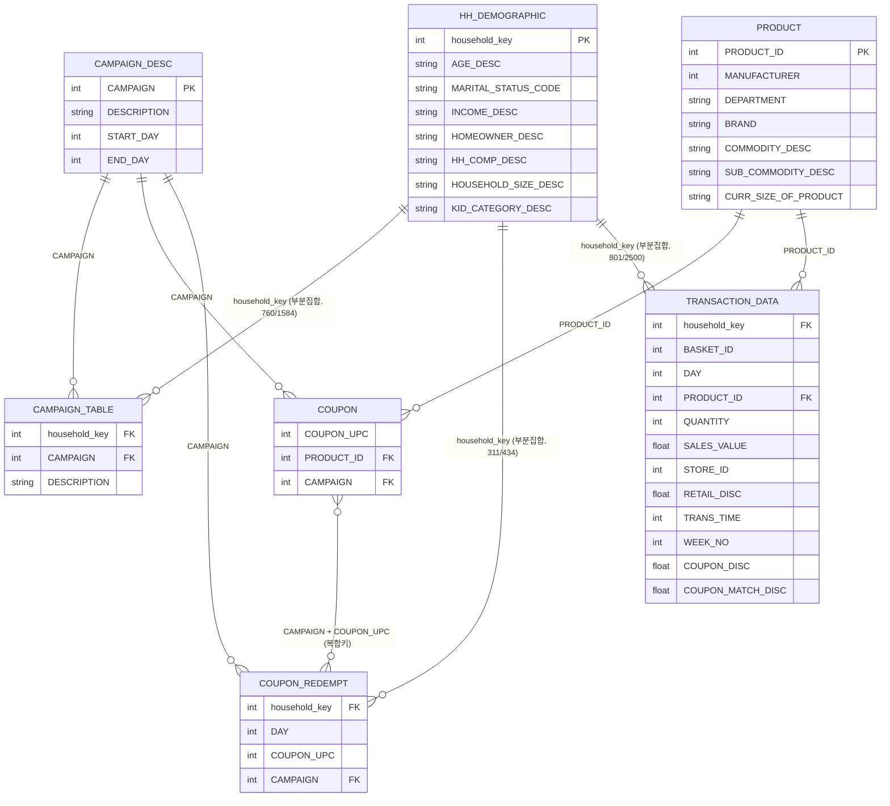

# 원본 데이터 구조 점검 (data/raw/)

- 생성일: 2026-08-10
- 대상: `data/raw/` 원본 CSV 7개 (dunnhumby The Complete Journey, `SOURCE_AND_LICENSE.md` 참고)
- 이 문서는 **데이터 구조 파악 목적**이며, 캠페인 처치/대조집단 구성이나 성향점수 매칭 등 분석은 아직 수행하지 않았다.
- 실행 환경: `.venv` (Python 3.14.5), `requirements.txt` 그대로 설치 (pandas 2.3.3, numpy 2.5.2, scikit-learn 1.9.0, scipy 1.18.0, statsmodels 0.14.6, matplotlib 3.11.1, seaborn 0.13.2, plotly 6.9.0, streamlit 1.61.1, jinja2 3.1.6)
- 재현 명령: `.venv/bin/python analysis/inspect_raw_data.py` (읽기 전용, `data/raw/` 파일을 수정하지 않음)

## 1. 파일별 요약

행 수와 열/자료형은 `pandas.read_csv` 기본 옵션으로 실제 로드해 확인한 값이다(헤더 제외).

| 파일 | 관측 단위 | 행 수 | 열 (dtype) | 주요 키 | 결측치 |
|---|---|---:|---|---|---|
| `campaign_desc.csv` | 캠페인 | 30 | DESCRIPTION(object), CAMPAIGN(int64), START_DAY(int64), END_DAY(int64) | `CAMPAIGN` (유일) | 없음 |
| `campaign_table.csv` | 캠페인×수신가구 | 7,208 | DESCRIPTION(object), household_key(int64), CAMPAIGN(int64) | `household_key`+`CAMPAIGN` (중복 0건) | 없음 |
| `coupon.csv` | 캠페인×쿠폰×대상상품 | 124,548 | COUPON_UPC(int64), PRODUCT_ID(int64), CAMPAIGN(int64) | `CAMPAIGN`+`COUPON_UPC`+`PRODUCT_ID` (중복 5,164건 존재) | 없음 |
| `coupon_redempt.csv` | 가구×쿠폰 사용 | 2,318 | household_key(int64), DAY(int64), COUPON_UPC(int64), CAMPAIGN(int64) | `household_key`+`CAMPAIGN`+`COUPON_UPC` | 없음 |
| `hh_demographic.csv` | 가구 | 801 | AGE_DESC~KID_CATEGORY_DESC(object 7개), household_key(int64) | `household_key` (유일) | 없음 |
| `product.csv` | 상품 | 92,353 | PRODUCT_ID(int64), MANUFACTURER(int64), DEPARTMENT/BRAND/COMMODITY_DESC/SUB_COMMODITY_DESC/CURR_SIZE_OF_PRODUCT(object) | `PRODUCT_ID` (유일) | 없음(단, `CURR_SIZE_OF_PRODUCT` 등 일부 값이 빈 문자열로 존재 — NaN이 아니라 공백) |
| `transaction_data.csv` | 거래행(장바구니 내 상품 1건) | 2,595,732 | household_key/BASKET_ID/DAY/PRODUCT_ID/QUANTITY/STORE_ID/TRANS_TIME/WEEK_NO(int64), SALES_VALUE/RETAIL_DISC/COUPON_DISC/COUPON_MATCH_DISC(float64) | `household_key`, `BASKET_ID`, `PRODUCT_ID`, `DAY` | 없음 |

고유 개체 수(실측): 캠페인 30개, `campaign_table` 수신 가구 1,584개, `coupon_redempt` 사용 가구 434개, `hh_demographic` 가구 801개, `transaction_data` 거래 가구 2,500개 / 장바구니(BASKET_ID) 276,484개 / 상품(PRODUCT_ID) 92,339개(거래에 등장한 것만), `product.csv` 전체 상품 92,353개, `coupon.csv` 고유 COUPON_UPC 1,135개.

## 2. ERD

`COUPON`↔`COUPON_REDEMPT`는 단일 FK가 아니라 `CAMPAIGN`+`COUPON_UPC` 복합키로 연결된다(`PRODUCT_ID`는 `COUPON_REDEMPT`에 없음). 실측 결과 `coupon_redempt`의 (CAMPAIGN, COUPON_UPC) 조합 643개가 모두 `coupon`의 1,397개 조합 안에 포함되어 참조 무결성은 확인됨(누락 0건).

## 3. 테이블 연결 구조 서술

- **캠페인 → 수신 가구**: `campaign_desc`(캠페인 정의, 30개)의 `CAMPAIGN`이 `campaign_table`(캠페인×가구, 7,208행)로 연결되어 "어느 가구가 어느 캠페인을 받았는지"를 결정한다. 한 가구가 여러 캠페인을 동시에 받을 수 있어 처치/대조집단을 정의할 때 `campaign_table`을 캠페인별로 전부 확인해 겹치는 캠페인 수신 가구를 가려내야 한다(가구 1,584명, 행 7,208 → 가구당 평균 4.5개 캠페인 수신).
- **캠페인 → 대상 상품**: `campaign_desc`의 `CAMPAIGN`이 `coupon`(124,548행)으로 연결되어 캠페인별로 어떤 상품(`PRODUCT_ID`)이 쿠폰 대상인지 정의한다. 같은 (CAMPAIGN, COUPON_UPC) 아래 여러 `PRODUCT_ID`가 달릴 수 있다(고유 조합 1,397개 대비 행 124,548개).
- **가구 → 쿠폰 사용 → 캠페인**: `coupon_redempt`(2,318행)는 가구가 특정 캠페인의 특정 쿠폰(COUPON_UPC)을 언제(DAY) 사용했는지 기록한다. `household_key`로 가구에, `CAMPAIGN`+`COUPON_UPC`로 `coupon`(대상 상품 정의)에 연결된다. CLAUDE.md 규칙상 이 정보는 캠페인 기간 중 정보이므로 성향점수 입력변수로는 쓰지 않고 발행 전 이력 점검용으로만 사용한다.
- **가구 → 거래 → 상품**: `transaction_data`(2,595,732행)는 가구(`household_key`)가 특정 날짜(`DAY`)에 특정 장바구니(`BASKET_ID`)에서 어떤 상품(`PRODUCT_ID`)을 얼마나(QUANTITY), 얼마에(SALES_VALUE) 샀는지, 쿠폰 할인(COUPON_DISC/COUPON_MATCH_DISC)이 적용됐는지를 담는다. `PRODUCT_ID`로 `product`(92,353개 상품의 부서/브랜드/카테고리)와 연결되고, `coupon`의 대상 상품과 교차하면 "캠페인 대상 상품 구매 여부/금액/수량"(주요 결과)을 만들 수 있다.
- **가구 → 인구통계**: `hh_demographic`(801행)은 가구 인구통계 사전 특성이며, 전체 가구의 일부만 커버한다(아래 4번 참고). 성향점수 입력변수(발행 전 정보)의 한 축이다.

## 4. 실측으로 확인한 데이터 품질/주의사항

- **`hh_demographic` 커버리지 부족**: 전체 801개 가구만 인구통계를 보유. `campaign_table`의 1,584개 수신 가구 중 760개(48%)만 인구통계 존재, 824개는 없음. `transaction_data`의 2,500개 거래 가구 중에는 801개(32%)만 존재, 1,699개는 없음. `coupon_redempt`의 434개 가구 중 311개(72%)만 존재. → 인구통계를 성향점수 입력변수로 쓰면 표본이 크게 줄어들 수 있음을 분석 단계에서 감안해야 한다.
- **`coupon.csv` 중복행**: (CAMPAIGN, COUPON_UPC, PRODUCT_ID) 완전 동일 조합이 5,164건 존재(전체 124,548행 중). 원인 미확인이며, 분석 단계에서 대상 상품 집합을 만들 때 중복 제거 여부를 결정해야 한다.
- **DAY는 달력 날짜가 아닌 상대 일자**: `campaign_desc`의 START_DAY/END_DAY 범위는 224~719, `transaction_data`의 DAY 범위는 1~711, `coupon_redempt`의 DAY 범위는 225~704다. 캠페인 END_DAY 최댓값(719)이 거래 데이터 DAY 최댓값(711)보다 커서, 일부 캠페인은 거래 데이터가 끝나는 시점까지도 종료되지 않았을 수 있다 — 캠페인별로 개별 확인 필요.
- **`COUPON_DISC`/`COUPON_MATCH_DISC` 부호**: `COUPON_DISC`는 0 또는 음수만 관측됨(최솟값 -55.93, 0이 아닌 행 36,422건) — 할인은 매출에서 차감되는 음수로 기록. `COUPON_MATCH_DISC` 0이 아닌 행 17,449건.
- **`QUANTITY` ≤ 0 행 14,466건** 존재(반품/조정 가능성) — `SALES_VALUE`는 음수가 0건으로 전부 0 이상. 주요 결과(구매금액/구매수량) 계산 시 이 행들을 어떻게 처리할지 분석 단계에서 결정 필요.
- **참조 무결성은 양호**: `transaction_data`의 `PRODUCT_ID` 전량이 `product.csv`에 존재(누락 0건), `coupon_redempt`의 (CAMPAIGN, COUPON_UPC) 전량이 `coupon.csv`에 존재(누락 0건), `campaign_table`/`coupon`/`coupon_redempt`의 `CAMPAIGN` 전량이 `campaign_desc`에 정의됨(차집합 0건).

## 5. 다음 단계 (이번 작업 범위 아님)

이 문서는 데이터 구조 파악용이며, 처치/대조집단 정의, 발행 전 변수 설계, 성향점수 매칭, 효과 추정, 수익성 계산 등은 수행하지 않았다. 다음 단계에서 특정 캠페인을 선택하면 `CLAUDE.md`·`DATA_DICTIONARY.md`·`PROJECT_CHECKLIST.md` 규칙에 따라 진행한다.
